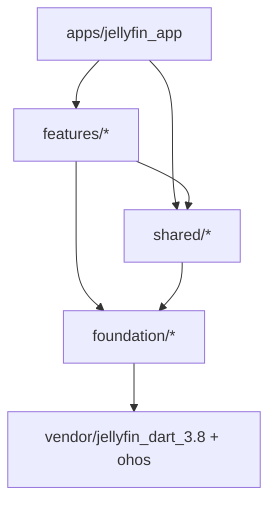

# Jellyfin 客户端业务组件化模块设计方案

> 目标：把当前 `jellyfin_service` 从“SDK + 页面 + 播放 + 调试 + AI + RVC 聚合包”拆成可独立开发、独立测试、独立版本分级的业务组件体系。

## 1. 当前结构判断

当前项目已经有一些天然模块雏形：

- 根包 `jellyfin_service`：集中承载配置、API Client、业务 Service、业务 Model、UI 页面、播放器、调试面板和 RVC 导出。
- `example/`：实际客户端示例应用，但依赖父级大包，无法按业务模块最小化依赖。
- `packages/`：已有本地包，包括 `jellyfin_dart_3.8`、`rvc_sdk`、`rvc_flutter`、`video_gesture_controls`、ohos 适配包等。
- `lib/src/ui/pages`：页面已经按业务功能命名，但仍在一个包里，页面间直接 import 较多。
- `test/`：当前只有基础 Auth/MediaLibrary 测试，未形成模块级测试体系。

主要问题：

- **包边界过粗**：根包同时是 SDK、UI Kit、业务 App 页面、播放器和扩展能力出口。
- **依赖被强制捆绑**：只想用认证或媒体库服务，也会被根包依赖中的视频、音频、动画、图片缓存、RVC 等拖进来。
- **业务不能独立版本化**：电影、音乐、播放、AI 推荐无法单独打版本、回滚或灰度。
- **测试粒度不够**：业务模块没有自己的 mock、fixture、widget test、contract test。
- **页面文件过大**：例如 `music_library_page.dart`、`movie_filter_page.dart`、`ai_recommend_page.dart` 已经适合拆到独立 feature package 内继续分层。

## 2. 推荐总方向

推荐使用 **Flutter/Dart monorepo + 多 package 业务组件化**。

核心原则：

- 每个业务模块都是一个独立 Flutter package，有自己的 `pubspec.yaml`、`test/`、`example/`、`CHANGELOG.md`、版本号。
- App 只负责装配模块、路由、主题、账号态和全局导航。
- 业务模块通过明确接口通信，不直接 import 其它业务模块的 `src/`。
- 底层能力下沉为基础包，业务模块依赖基础包，基础包不反向依赖业务模块。
- 旧的 `jellyfin_service` 保留为兼容 facade，一段时间内只 re-export 新包，降低迁移风险。

## 3. 目标目录结构

建议最终结构如下：

```text
apps/
  jellyfin_app/                         # 正式客户端壳工程
  jellyfin_demo_app/                    # 模块集成演示，可由当前 example 迁移而来

packages/
  foundation/
    jellyfin_core/                      # 配置、异常、日志、Result、通用接口
    jellyfin_api/                       # Dio、鉴权头、jellyfin_dart 适配、API Client
    jellyfin_platform/                  # 平台判断、ohos/web/native 适配能力
    jellyfin_debug_tools/               # 网络模拟器、调试面板

  shared/
    jellyfin_models/                    # 纯业务模型，尽量不依赖 Flutter UI
    jellyfin_ui_kit/                    # 通用 UI 组件、主题 token、图片组件、空/错/加载态
    jellyfin_testing/                   # mock client、fixture、fake repository、测试工具

  features/
    jellyfin_auth/                      # 登录、注册、Quick Connect、服务器发现
    jellyfin_home/                      # 媒体库首页、继续观看、个人入口
    jellyfin_media/                     # 通用媒体项、详情页、演员/导演详情
    jellyfin_movies/                    # 电影筛选、电影详情增强
    jellyfin_series/                    # 剧集、季、集列表
    jellyfin_music/                     # 音乐库、专辑、歌手、歌词、MiniPlayer
    jellyfin_playback/                  # 视频播放、画质切换、播放进度上报
    jellyfin_ai_recommendation/         # AI 推荐、SSE、推荐卡片
    rvc_flutter/                        # 保留现有独立 RVC UI 模块

  plugins/
    video_gesture_controls/             # 保留现有手势插件

  vendor/
    jellyfin_dart_3.8/                  # 上游接口 SDK 兼容版
    ohos/                               # 鸿蒙适配三方插件

jellyfin_service/                       # 可选：兼容 facade 包，迁移期 re-export 新模块
```

如果不想一次移动根包，可以先保持当前根目录为 facade，逐步把真实实现挪到 `packages/`。

## 4. 分层模型

整体依赖方向：



业务模块内部建议使用轻量三层：

```text
lib/
  <package_name>.dart                   # 唯一公共出口
  src/
    domain/                             # 业务模型、repository 抽象、use case
    data/                               # DTO adapter、repository 实现、API 调用
    presentation/                       # pages/widgets/controllers
    routing/                            # 本模块路由定义和入口对象
```

规则：

- `domain` 不依赖 Flutter UI。
- `data` 可以依赖 `jellyfin_api` 和 `jellyfin_dart` adapter。
- `presentation` 只通过 use case/repository 抽象拿数据。
- 模块外只能 import `package:<module>/<module>.dart`，不允许 import `package:<module>/src/...`。

## 5. 模块职责拆分

### 5.1 foundation 层

| 包 | 责任 | 当前迁移来源 |
|---|---|---|
| `jellyfin_core` | `JellyfinConfiguration`、异常基类、通用 Result、日志抽象、模块注册协议 | `lib/src/jellyfin_configuration.dart`、`exceptions/` |
| `jellyfin_api` | `ApiClient`、Dio 配置、鉴权头、token 更新、底层 API 访问 | `lib/src/core/api_client.dart` |
| `jellyfin_platform` | web/native/ohos 条件能力、平台服务抽象 | `sse_fetch_*`、后续 ohos 判断 |
| `jellyfin_debug_tools` | 慢网模拟、调试浮层、诊断工具 | `lib/src/debug/*` |

### 5.2 shared 层

| 包 | 责任 | 当前迁移来源 |
|---|---|---|
| `jellyfin_models` | `UserProfile`、`MediaItem`、`MediaLibrary`、`MusicSong` 等纯业务模型 | `lib/src/models/*` |
| `jellyfin_ui_kit` | 通用图片、卡片骨架、布局选择器、加载态、错误态、主题 token | `ui/widgets` 中跨业务复用部分 |
| `jellyfin_testing` | fake API、mock repository、fixture、golden/widget test helper | 当前新增 |

注意：`jellyfin_models` 不建议继续直接 import `jellyfin_dart`。DTO 到业务模型的转换应尽量放到各 feature 的 `data/adapter` 中，避免纯模型包被接口 SDK 绑定。

### 5.3 features 层

| 业务包 | 独立能力 | 当前迁移来源 |
|---|---|---|
| `jellyfin_auth` | 登录、注册、Quick Connect、服务器发现、账号态恢复 | `auth_service.dart`、`server_discovery_service.dart`、`login_page.dart` |
| `jellyfin_home` | 媒体库主页、继续观看、个人入口、模块入口编排 | `media_libraries_page.dart`、`continue_watching_card.dart` |
| `jellyfin_media` | 通用媒体列表、媒体详情、人物详情、图片服务 | `media_library_service.dart` 的通用部分、`media_item_detail_page.dart`、`person_detail_page.dart` |
| `jellyfin_movies` | 电影筛选、电影详情、电影特有过滤条件 | `movie_filter_page.dart`、`movie_detail_page.dart`、`movie_filter_models.dart` |
| `jellyfin_series` | 剧集、季、集导航和详情 | `seasons_page.dart`、`episodes_page.dart` |
| `jellyfin_music` | 音乐库、歌手、专辑、歌曲、歌词、音频播放状态 | `music_service.dart`、`music_library_page.dart`、`album_detail_page.dart`、`artist_detail_page.dart`、`lyrics_page.dart`、`audio_playback_manager.dart` |
| `jellyfin_playback` | 视频播放、转码/直连选择、画质自适应、进度上报 | `playback_service.dart`、`video_player_page.dart`、`video_quality_models.dart` |
| `jellyfin_ai_recommendation` | SSE、推荐会话、推荐卡片、AI 推荐页面 | `ai_recommendation_service.dart`、`ai_recommend_page.dart`、`ai_recommendation_models.dart` |
| `rvc_flutter` | AI 翻唱/RVC 页面和交互 | 已存在，保留独立模块 |

## 6. 模块通信与路由设计

App 壳负责模块注册：

```dart
abstract class JellyfinFeatureModule {
  String get name;
  String get version;
  List<RouteBase> buildRoutes(JellyfinModuleContext context);
  List<NavigationEntry> buildNavigationEntries(JellyfinModuleContext context);
}
```

模块不直接跳转到其它模块内部页面，而是通过路由名或接口请求 App 壳协调：

```dart
abstract class JellyfinNavigation {
  Future<T?> push<T>(String routeName, {Map<String, Object?> arguments});
}
```

例如 AI 推荐模块点击卡片：

- 当前：`AiRecommendPage` 直接构造 `MediaItemDetailPage` 或音乐播放。
- 目标：AI 模块发出 `OpenMediaItemIntent(itemId, type)`，App 壳根据已注册模块路由分发到媒体详情、音乐、播放等模块。

这样 AI 模块可以独立开发测试，不需要直接依赖媒体详情页实现。

## 7. 版本分级策略

建议每个 package 单独版本号，并建立模块等级：

| 等级 | 类型 | 版本要求 | 示例 |
|---|---|---|---|
| L0 | 基础能力 | 稳定优先，破坏性变更极少 | `jellyfin_core`、`jellyfin_api` |
| L1 | 共享模型/UI | 需要兼容多个业务模块 | `jellyfin_models`、`jellyfin_ui_kit` |
| L2 | 业务能力 | 可按业务节奏独立迭代 | `jellyfin_music`、`jellyfin_movies`、`jellyfin_ai_recommendation` |
| L3 | App 装配 | 跟随客户端版本发布 | `jellyfin_app` |
| L4 | 实验/扩展 | 可 alpha/beta 灰度 | `rvc_flutter`、`video_gesture_controls` |

语义化版本规则：

- `MAJOR`：公共 API、路由协议、模型字段发生不兼容变更。
- `MINOR`：新增页面、能力、可选字段或向后兼容 API。
- `PATCH`：bugfix、UI 修正、内部实现优化。
- 每个模块维护 `CHANGELOG.md`。
- App 维护兼容矩阵，例如 `jellyfin_app 0.4.x` 支持 `jellyfin_music ^0.2.0`、`jellyfin_playback ^0.3.0`。

发布形态可以先用 path 依赖，后续转为内部 Git tag 或私有 pub 源。

## 8. 独立开发方式

每个业务模块至少包含：

```text
packages/features/jellyfin_music/
  pubspec.yaml
  CHANGELOG.md
  README.md
  lib/jellyfin_music.dart
  lib/src/domain/
  lib/src/data/
  lib/src/presentation/
  test/
  example/
```

模块开发者可以单独执行：

```bash
cd packages/features/jellyfin_music
flutter test
flutter run -d windows example
```

`example/` 应支持两种模式：

- fake 数据模式：不需要真实 Jellyfin 服务，便于 UI 和业务开发。
- live 服务模式：读取本地配置，连接真实 Jellyfin 做集成验证。

## 9. 测试体系

每个模块必须有自己的测试金字塔：

| 测试类型 | 放置位置 | 目标 |
|---|---|---|
| Unit Test | 模块 `test/domain`、`test/data` | use case、filter、adapter、状态机 |
| Repository Contract Test | `jellyfin_api` 或 feature `test/data` | API 返回和业务模型转换协议 |
| Widget Test | feature `test/presentation` | 页面 loading/empty/error/content 状态 |
| Golden Test | `jellyfin_ui_kit` 和核心业务卡片 | 稳定 UI 基线 |
| Integration Test | `apps/jellyfin_app/integration_test` | 模块组合、登录后主流程 |

建议新增 `jellyfin_testing`：

- `FakeJellyfinApiClient`
- `FakeAuthRepository`
- `FakeMediaRepository`
- `FakeMusicRepository`
- 常用 fixture：电影、剧集、音乐、歌词、AI 推荐 SSE 事件

这样业务模块不依赖真实服务器也能单独开发和回归。

## 10. 依赖治理规则

建议在代码评审和 CI 中强制以下规则：

- feature 之间默认不互相依赖；确实需要协作时，通过 App 壳路由或 shared contract。
- `foundation` 不得 import `features`。
- `shared` 不得 import `features`。
- feature 外部不得 import 其它包的 `src/`。
- UI 包不得把 `jellyfin_dart` DTO 暴露到 public API。
- RVC、AI、视频手势等扩展能力不得从根 SDK 默认导出，应由 App 壳选择启用。
- 新模块必须带 `README.md`、`CHANGELOG.md`、`test/` 和最小 `example/`。

## 11. 迁移路线

### 阶段 0：冻结公共出口，做依赖审计

- 保留当前根包行为不变。
- 新增模块化规范文档和依赖规则。
- 标记 `jellyfin_service.dart` 中哪些 export 属于临时 facade。
- 建立模块列表和迁移优先级。

### 阶段 1：拆 foundation/shared

- 创建 `jellyfin_core`、`jellyfin_api`、`jellyfin_models`、`jellyfin_ui_kit`。
- 先迁移配置、异常、API Client、通用模型、通用图片组件。
- 根包继续 re-export，确保 example 不大改。

### 阶段 2：拆认证和 App 壳

- 创建 `apps/jellyfin_app`，把当前 `example` 升级为正式 App 壳。
- 创建 `jellyfin_auth`，迁移登录、注册、服务器发现。
- App 壳负责依赖注入、路由注册、全局主题和用户会话。

### 阶段 3：拆媒体主链路

- 创建 `jellyfin_home`、`jellyfin_media`、`jellyfin_movies`、`jellyfin_series`。
- 先把页面迁移到模块内，随后再拆大页面内部 controller/widget。
- `MediaLibraryService` 拆成通用媒体 repository 和电影/剧集专用 use case。

### 阶段 4：拆音乐和播放

- 创建 `jellyfin_music`、`jellyfin_playback`。
- `AudioPlaybackManager` 从全局单例改为可注入 service，方便模块测试。
- 播放模块负责视频播放协议，音乐模块只保留音频播放业务状态。

### 阶段 5：拆 AI/RVC/实验能力

- 创建 `jellyfin_ai_recommendation`。
- AI 模块通过 intent/route 打开媒体详情，不直接依赖其它 feature 页面。
- `rvc_flutter` 保持独立，移除根包默认 re-export，由音乐模块或 App 壳按需依赖。
- `video_gesture_controls` 作为 playback 的可选依赖或插件层。

### 阶段 6：版本化和 CI

- 引入 workspace 管理工具，例如 Dart pub workspace 或 Melos。
- 每个包独立执行 analyze/test。
- 建立变更检测：只测试受影响包及其下游。
- 每个模块维护 changelog，按业务模块独立打 tag。

## 12. 第一批建议落地点

优先级建议：

1. **先拆 foundation/shared**：风险最低，收益最大，能解除基础耦合。
2. **再拆 auth + app shell**：登录是所有业务入口，拆出来后模块装配方式基本成型。
3. **第三拆 music**：当前音乐页面最大，且 RVC、歌词、MiniPlayer、音频播放状态耦合明显，最能验证组件化收益。
4. **第四拆 playback**：视频播放依赖重，独立后能避免所有业务默认拉取 video/chewie。
5. **最后拆 AI 推荐**：AI 模块需要和媒体/音乐路由协作，等模块通信协议稳定后再拆更稳。

不建议第一步就全量移动所有文件。更稳的方式是“兼容 facade + 单模块迁移 + 测试补齐”，每迁出一个业务模块，都保留原有 App 行为。

## 13. 验收标准

完成模块化一期后，应满足：

- 任意一个业务模块可以在自己的目录里单独 `flutter test`。
- App 可以选择不引入 RVC、AI、视频播放等扩展模块。
- 修改音乐模块不需要重新发布认证模块。
- 模块之间没有 `package:xxx/src/...` 跨包 import。
- 根包 `jellyfin_service` 不再承载真实实现，只作为兼容聚合层或被 App 壳替代。
- 新业务必须以 package 形式进入 `packages/features/`，不再直接塞进根包 `lib/src/ui/pages`。

## 14. 推荐结论

当前项目最适合走 **业务 feature package 化**，而不是只做目录重排。

短期目标是先把根包拆成“基础能力 + 共享模型/UI + 独立业务 feature + App 壳”。中期目标是每个业务模块具备自己的测试、示例和版本。长期目标是 App 通过模块注册协议组合业务，RVC、AI 推荐、视频手势等能力都能按需启用、独立迭代、独立回滚。
