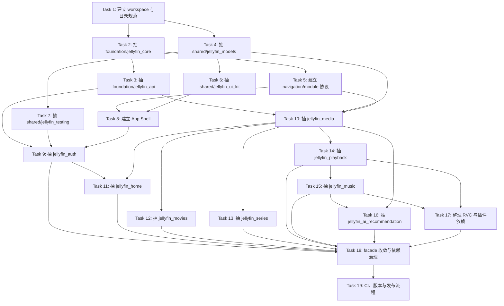

# Jellyfin 客户端模块化执行计划

> 本文档细化 `MODULARIZATION_DESIGN.md` 的落地顺序，重点说明任务依赖、可并行范围、每个阶段的产出和验收方式。

## 0. 执行原则

这次拆分不要一次性“大搬家”。推荐采用 **兼容 facade + 渐进迁移 + 每个模块独立验收**。

核心原则：

- 先建立基础协议和 workspace，再迁业务。
- 先拆低风险基础层，再拆页面复杂的业务层。
- 每个业务模块迁出后必须能单独 `flutter test`。
- 当前根包 `jellyfin_service` 在迁移期继续保留，对外 re-export 新包，保证现有 `example` 不会一次性断掉。
- 每个任务完成后独立提交，方便回滚。
- 并行任务只允许发生在依赖已稳定的模块之间。

## 1. 总体依赖图



## 2. 并行批次总览

| 批次 | 可并行任务 | 必须等待 | 说明 |
|---|---|---|---|
| Batch A | Task 1 | 无 | 先建立目录、workspace、约束。 |
| Batch B | Task 2、Task 4 | Task 1 | `jellyfin_core` 和 `jellyfin_models` 可并行抽。 |
| Batch C | Task 3、Task 5、Task 6、Task 7 | Task 2/4 各自完成 | API、导航协议、UI Kit、测试工具可分头做。 |
| Batch D | Task 8、Task 9 | Task 3、5、6、7 | App Shell 与 Auth 紧密相关，建议串行为主。 |
| Batch E | Task 10、Task 11 | Task 8、9 | 先抽通用媒体和首页，因为其它业务都依赖媒体入口。 |
| Batch F | Task 12、Task 13 | Task 10 | 电影和剧集可并行。 |
| Batch G | Task 14 | Task 10 | 播放模块独立，但依赖通用媒体模型和 API。 |
| Batch H | Task 15 | Task 14 | 音乐依赖音频播放状态，也会接 RVC 入口。 |
| Batch I | Task 16、Task 17 | Task 10、14、15 | AI 与 RVC/插件整理可并行，但都依赖前面模块协议稳定。 |
| Batch J | Task 18、Task 19 | 所有业务迁移完成 | 收敛 facade、加依赖治理、CI 和版本发布。 |

## 3. Task 1：建立 workspace 与目录规范

**目标**

把仓库从“单根包 + packages 零散包”整理成明确的 monorepo 工作区，但不迁移业务逻辑。

**依赖**

- 无前置依赖。

**可并行**

- 不建议并行。它是后续所有任务的地基。

**涉及路径**

- 新增：`apps/`
- 新增：`packages/foundation/`
- 新增：`packages/shared/`
- 新增：`packages/features/`
- 新增：`packages/plugins/`
- 新增：`packages/vendor/`
- 修改：根 `pubspec.yaml`
- 新增：`MODULE_BOUNDARY_RULES.md`

**执行内容**

1. 创建目标目录，但先不移动源码。
2. 确定 workspace 工具：
   - 优先：Dart/Flutter pub workspace，简单直接。
   - 备选：Melos，适合后续批量 test/analyze/version。
3. 定义模块命名规则：
   - foundation 包：`jellyfin_core`、`jellyfin_api`
   - shared 包：`jellyfin_models`、`jellyfin_ui_kit`
   - feature 包：`jellyfin_auth`、`jellyfin_music`
4. 写边界规则：
   - 禁止跨包 import `src/`
   - feature 不直接依赖 feature
   - public API 不暴露 `jellyfin_dart` DTO

**验收**

- 根目录存在 `apps/`、`packages/foundation/`、`packages/shared/`、`packages/features/`。
- 现有 `flutter test` 行为不因空目录变化而改变。
- 文档明确列出 import 边界。

**建议提交**

```bash
git add apps packages MODULE_BOUNDARY_RULES.md pubspec.yaml
git commit -m "chore: initialize modular workspace structure"
```

## 4. Task 2：抽 `jellyfin_core`

**目标**

建立最底层核心包，放不依赖 Flutter UI、不依赖具体业务页面的通用能力。

**依赖**

- 必须依赖 Task 1。

**可并行**

- 可与 Task 4 并行。

**涉及路径**

- 创建：`packages/foundation/jellyfin_core/pubspec.yaml`
- 创建：`packages/foundation/jellyfin_core/lib/jellyfin_core.dart`
- 迁移：`lib/src/jellyfin_configuration.dart`
- 迁移：`lib/src/exceptions/jellyfin_exception.dart`
- 迁移：`lib/src/exceptions/api_exception.dart`
- 迁移：`lib/src/exceptions/authentication_exception.dart`
- 保留兼容：`lib/jellyfin_service.dart` re-export 新包

**执行内容**

1. 创建 `jellyfin_core` package。
2. 迁移配置与异常。
3. 新增模块协议基础类型：
   - `JellyfinModuleContext`
   - `JellyfinFeatureModule`
   - `AppNavigator`
   - `NavigationIntent`
4. 原根包继续导出这些类型，避免现有代码大面积修改。

**验收**

- `jellyfin_core` 可以单独 `dart test`。
- 根包仍可 import `JellyfinConfiguration`。
- 不出现 `package:flutter/material.dart` 依赖。

**建议提交**

```bash
git add packages/foundation/jellyfin_core lib/jellyfin_service.dart lib/src
git commit -m "refactor(core): extract jellyfin core package"
```

## 5. Task 3：抽 `jellyfin_api`

**目标**

把 Dio、鉴权头、`jellyfin_dart` 接入和 token 更新能力从根包抽出。

**依赖**

- 必须依赖 Task 2。

**可并行**

- 可与 Task 5、Task 6、Task 7 并行。

**涉及路径**

- 创建：`packages/foundation/jellyfin_api/pubspec.yaml`
- 创建：`packages/foundation/jellyfin_api/lib/jellyfin_api.dart`
- 迁移：`lib/src/core/api_client.dart`
- 修改：`lib/src/jellyfin_client.dart`
- 修改：根 `pubspec.yaml`

**执行内容**

1. 创建 `JellyfinApiClient`，封装当前 `ApiClient`。
2. 保留 `jellyfin_dart` 只在 `jellyfin_api` 或 feature data adapter 使用。
3. 提供统一接口：
   - `dio`
   - `jellyfinClient`
   - `updateAccessToken`
   - `config`
4. 根包 `ApiClient` 在迁移期可变成兼容 typedef 或 re-export。

**验收**

- `jellyfin_api` 单独测试鉴权头构造。
- 现有 `AuthService`、`MediaLibraryService` 能继续通过根包编译。
- public API 不要求 App 直接 import `jellyfin_dart`。

**建议提交**

```bash
git add packages/foundation/jellyfin_api lib/src/core lib/src/jellyfin_client.dart pubspec.yaml
git commit -m "refactor(api): extract jellyfin api package"
```

## 6. Task 4：抽 `jellyfin_models`

**目标**

把跨业务共享的纯业务模型抽出，同时避免把 `jellyfin_dart` DTO 暴露给业务层。

**依赖**

- 必须依赖 Task 1。

**可并行**

- 可与 Task 2 并行。

**涉及路径**

- 创建：`packages/shared/jellyfin_models/pubspec.yaml`
- 创建：`packages/shared/jellyfin_models/lib/jellyfin_models.dart`
- 迁移或复制后收敛：
  - `lib/src/models/user_models.dart`
  - `lib/src/models/media_library_models.dart`
  - `lib/src/models/media_item_models.dart`
  - `lib/src/models/person_models.dart`
  - `lib/src/models/server_discovery_models.dart`

**执行内容**

1. 定义最小共享模型集合：
   - `UserProfile`
   - `MediaLibrary`
   - `MediaLibraryType`
   - `MediaItemSummary`
   - `MediaKind`
   - `ImageRef`
   - `PersonRef`
2. 将 DTO 转换逻辑暂时保留在原 service，后续迁移到 feature data adapter。
3. 不把 `MovieFilter`、`MusicSong`、`Episode` 等强业务模型放入共享包，除非多个模块确实共用。

**验收**

- `jellyfin_models` 不依赖 `flutter`。
- `jellyfin_models` 不依赖 `jellyfin_dart`。
- 根包继续导出旧模型名，现有调用不破。

**建议提交**

```bash
git add packages/shared/jellyfin_models lib/jellyfin_service.dart
git commit -m "refactor(models): extract shared jellyfin models"
```

## 7. Task 5：建立导航与模块注册协议

**目标**

解决跨业务页面跳转，不使用全局页面枚举，而使用 typed intent + App 壳分发。

**依赖**

- 必须依赖 Task 2。

**可并行**

- 可与 Task 3、Task 6、Task 7 并行。

**涉及路径**

- 修改：`packages/foundation/jellyfin_core/lib/src/navigation/app_navigator.dart`
- 修改：`packages/foundation/jellyfin_core/lib/src/navigation/navigation_intent.dart`
- 修改：`packages/foundation/jellyfin_core/lib/src/module/jellyfin_feature_module.dart`
- 新增：`NAVIGATION_DESIGN.md`

**执行内容**

1. 基础层只定义协议：
   - `NavigationIntent`
   - `AppNavigator`
   - `JellyfinFeatureModule`
   - `NavigationEntry`
2. 各 feature 自己定义 intent：
   - `OpenMediaItemIntent`
   - `OpenAlbumIntent`
   - `OpenVideoPlaybackIntent`
3. App 壳实现 intent 到 route 的分发。
4. 禁止基础层定义 `AppPage.xxx` 这种全局页面枚举。

**验收**

- 基础层不知道电影、音乐、剧集页面类名。
- 任一 feature 可以在测试里用 fake navigator 验证“发出了跳转意图”。

**建议提交**

```bash
git add packages/foundation/jellyfin_core NAVIGATION_DESIGN.md
git commit -m "feat(core): add module navigation contracts"
```

## 8. Task 6：抽 `jellyfin_ui_kit`

**目标**

把跨业务复用 UI 组件抽到 shared UI 包。

**依赖**

- 必须依赖 Task 4。

**可并行**

- 可与 Task 3、Task 5、Task 7 并行。

**涉及路径**

- 创建：`packages/shared/jellyfin_ui_kit/pubspec.yaml`
- 创建：`packages/shared/jellyfin_ui_kit/lib/jellyfin_ui_kit.dart`
- 迁移：
  - `lib/src/ui/widgets/jellyfin_image.dart`
  - `lib/src/ui/widgets/view_mode_selector.dart`
  - `lib/src/ui/widgets/alphabet_index_bar.dart`
  - `lib/src/ui/widgets/media_list_builder.dart`
  - `lib/src/ui/widgets/media_list_layouts/*`

**执行内容**

1. 先迁移真正跨业务复用的组件。
2. 和具体业务强绑定的卡片暂不迁，比如音乐专属 card 留给音乐模块。
3. `JellyfinImage` 依赖图片加载能力时，通过接口注入，不直接依赖某个 feature service。

**验收**

- `jellyfin_ui_kit` 可以单独跑 widget test。
- 不依赖任何 `packages/features/*`。
- 根包继续 re-export 迁移后的组件。

**建议提交**

```bash
git add packages/shared/jellyfin_ui_kit lib/jellyfin_service.dart
git commit -m "refactor(ui): extract shared ui kit package"
```

## 9. Task 7：建立 `jellyfin_testing`

**目标**

为后续业务模块独立测试提供 fake、fixture 和测试工具。

**依赖**

- 必须依赖 Task 4。

**可并行**

- 可与 Task 3、Task 5、Task 6 并行。

**涉及路径**

- 创建：`packages/shared/jellyfin_testing/pubspec.yaml`
- 创建：`packages/shared/jellyfin_testing/lib/jellyfin_testing.dart`
- 创建：`packages/shared/jellyfin_testing/lib/src/fakes/`
- 创建：`packages/shared/jellyfin_testing/lib/src/fixtures/`

**执行内容**

1. 创建 fake repository：
   - `FakeAuthRepository`
   - `FakeMediaRepository`
   - `FakeMusicRepository`
2. 创建 fixture：
   - user fixture
   - media library fixture
   - movie fixture
   - series fixture
   - music fixture
   - AI SSE fixture
3. 提供测试 helper：
   - fake navigator
   - fixed configuration
   - fake image provider

**验收**

- 后续 feature 可以不连真实 Jellyfin 服务跑单元测试和 widget test。
- fixtures 不依赖真实用户账号和服务器。

**建议提交**

```bash
git add packages/shared/jellyfin_testing
git commit -m "test: add shared testing utilities"
```

## 10. Task 8：建立 App Shell

**目标**

把当前 `example` 的客户端壳职责迁到 `apps/jellyfin_app`，负责模块装配、路由、主题和全局状态。

**依赖**

- 必须依赖 Task 5、Task 6。
- 建议等待 Task 3 完成。

**可并行**

- 不建议与 Task 9 并行，Auth 是 App Shell 第一条主流程。

**涉及路径**

- 创建：`apps/jellyfin_app/pubspec.yaml`
- 创建：`apps/jellyfin_app/lib/main.dart`
- 创建：`apps/jellyfin_app/lib/src/app.dart`
- 创建：`apps/jellyfin_app/lib/src/router/app_router.dart`
- 创建：`apps/jellyfin_app/lib/src/di/app_module_context.dart`
- 参考：`example/lib/main.dart`

**执行内容**

1. 新建正式 App 壳。
2. 先只装配现有根包页面，保证行为不变。
3. 实现 `AppNavigator`。
4. 预留模块注册列表：
   - auth module
   - home module
   - media module
   - music module
   - playback module

**验收**

- `apps/jellyfin_app` 可以启动到登录页。
- 旧 `example` 暂时保留，不立即删除。

**建议提交**

```bash
git add apps/jellyfin_app
git commit -m "feat(app): add modular app shell"
```

## 11. Task 9：抽 `jellyfin_auth`

**目标**

认证业务单独成包，支持独立开发、测试、版本化。

**依赖**

- 必须依赖 Task 3、Task 5、Task 7、Task 8。

**可并行**

- 不建议并行。Auth 是后续模块会话上下文来源。

**涉及路径**

- 创建：`packages/features/jellyfin_auth/pubspec.yaml`
- 创建：`packages/features/jellyfin_auth/lib/jellyfin_auth.dart`
- 迁移：
  - `lib/src/services/auth_service.dart`
  - `lib/src/services/server_discovery_service.dart`
  - `lib/src/ui/pages/login_page.dart`
  - `lib/src/models/server_discovery_models.dart`
- 修改：`apps/jellyfin_app`
- 修改：`lib/jellyfin_service.dart`

**执行内容**

1. 建立 auth domain：
   - `AuthRepository`
   - `AuthenticateUseCase`
   - `RegisterWithAdminUseCase`
   - `ServerDiscoveryUseCase`
2. 建立 data adapter：
   - `JellyfinAuthRepository`
   - `JellyfinServerDiscoveryRepository`
3. 登录页通过 use case 工作，不直接 new `JellyfinClient`。
4. 登录成功后由 App Shell 保存 session 并进入 home。

**验收**

- `jellyfin_auth` 可单独 `flutter test`。
- 用 fake repository 可测试登录成功/失败 UI。
- App Shell 仍能完成登录跳转。

**建议提交**

```bash
git add packages/features/jellyfin_auth apps/jellyfin_app lib/jellyfin_service.dart
git commit -m "refactor(auth): extract auth feature package"
```

## 12. Task 10：抽 `jellyfin_media`

**目标**

迁出通用媒体能力，为电影、剧集、播放、AI 提供稳定基础。

**依赖**

- 必须依赖 Task 3、Task 4、Task 5。
- 建议等待 Task 9，确保用户态可用。

**可并行**

- 完成后 Task 12、Task 13、Task 14 可并行开始。

**涉及路径**

- 创建：`packages/features/jellyfin_media/pubspec.yaml`
- 创建：`packages/features/jellyfin_media/lib/jellyfin_media.dart`
- 迁移：
  - `lib/src/services/media_library_service.dart` 的通用部分
  - `lib/src/services/image_service.dart`
  - `lib/src/ui/pages/media_items_page.dart`
  - `lib/src/ui/pages/media_item_detail_page.dart`
  - `lib/src/ui/pages/person_detail_page.dart`
  - `lib/src/models/person_models.dart`
- 修改：`apps/jellyfin_app`
- 修改：`lib/jellyfin_service.dart`

**执行内容**

1. 拆 `MediaRepository`：
   - `getMediaLibraries`
   - `getMediaItems`
   - `getMediaItemDetail`
   - `getPersonDetail`
   - `getPersonCredits`
2. 定义通用跳转 intent：
   - `OpenMediaItemIntent`
   - `OpenPersonIntent`
3. 媒体详情页内部通过 intent 打开播放或剧集，不直接构造其它 feature 页面。
4. 电影和剧集专用方法暂时可保留 adapter，下一步拆走。

**验收**

- `jellyfin_media` 可单独测试 repository adapter。
- App 壳可以打开通用媒体详情。
- 电影/剧集页面还没拆时仍能通过 facade 使用原行为。

**建议提交**

```bash
git add packages/features/jellyfin_media apps/jellyfin_app lib/jellyfin_service.dart
git commit -m "refactor(media): extract shared media feature package"
```

## 13. Task 11：抽 `jellyfin_home`

**目标**

首页只负责业务入口编排，不持有电影/音乐/剧集具体页面实现。

**依赖**

- 必须依赖 Task 9、Task 10。

**可并行**

- 可与 Task 12 或 Task 13 轻度并行，但建议先完成 Home 的路由协议。

**涉及路径**

- 创建：`packages/features/jellyfin_home/pubspec.yaml`
- 创建：`packages/features/jellyfin_home/lib/jellyfin_home.dart`
- 迁移：
  - `lib/src/ui/pages/media_libraries_page.dart`
  - `lib/src/ui/pages/personal_page.dart`
  - `lib/src/ui/widgets/library_card.dart`
  - `lib/src/ui/widgets/continue_watching_card.dart`

**执行内容**

1. 首页点击媒体库时发 intent：
   - movies -> `OpenMovieLibraryIntent`
   - music -> `OpenMusicLibraryIntent`
   - tvshows -> `OpenSeriesLibraryIntent`
   - unknown -> `OpenMediaLibraryIntent`
2. 继续观看卡片发 `OpenMediaItemIntent` 或 `OpenVideoPlaybackIntent`。
3. 个人中心只依赖用户和媒体 repository，不直接引用具体业务页面。

**验收**

- Home 用 fake media library 数据可独立跑 widget test。
- App 壳可以注册 home 路由作为登录后的首页。

**建议提交**

```bash
git add packages/features/jellyfin_home apps/jellyfin_app lib/jellyfin_service.dart
git commit -m "refactor(home): extract home feature package"
```

## 14. Task 12：抽 `jellyfin_movies`

**目标**

电影筛选和电影详情独立成包。

**依赖**

- 必须依赖 Task 10。

**可并行**

- 可与 Task 13 并行。
- 可与 Task 14 并行，但注意都可能改媒体详情 intent，需要先约定接口。

**涉及路径**

- 创建：`packages/features/jellyfin_movies/pubspec.yaml`
- 创建：`packages/features/jellyfin_movies/lib/jellyfin_movies.dart`
- 迁移：
  - `lib/src/ui/pages/movie_filter_page.dart`
  - `lib/src/ui/pages/movie_detail_page.dart`
  - `lib/src/models/movie_filter_models.dart`
  - `MediaLibraryService.getMovies` 相关逻辑

**执行内容**

1. 定义电影模块模型：
   - `MovieFilter`
   - `MovieSortOption`
   - `MovieListState`
2. 定义 `MovieRepository.getMovies(MovieFilter filter)`。
3. 定义 `OpenMovieLibraryIntent`。
4. 电影详情打开通用媒体详情或播放时走 navigator intent。

**验收**

- `MovieFilter` 有独立单元测试。
- 电影列表可用 fake repository 做 widget test。
- App 壳点击电影库进入电影模块。

**建议提交**

```bash
git add packages/features/jellyfin_movies apps/jellyfin_app lib/jellyfin_service.dart
git commit -m "refactor(movies): extract movies feature package"
```

## 15. Task 13：抽 `jellyfin_series`

**目标**

剧集、季、集导航独立成包。

**依赖**

- 必须依赖 Task 10。

**可并行**

- 可与 Task 12 并行。

**涉及路径**

- 创建：`packages/features/jellyfin_series/pubspec.yaml`
- 创建：`packages/features/jellyfin_series/lib/jellyfin_series.dart`
- 迁移：
  - `lib/src/ui/pages/seasons_page.dart`
  - `lib/src/ui/pages/episodes_page.dart`
  - `MediaLibraryService.getSeasons`
  - `MediaLibraryService.getEpisodes`
  - `Season`、`Episode` 相关模型

**执行内容**

1. 定义剧集模块模型：
   - `SeriesDetail`
   - `Season`
   - `Episode`
2. 定义 intent：
   - `OpenSeriesIntent`
   - `OpenSeasonIntent`
   - `OpenEpisodeIntent`
3. Episode 播放走 `OpenVideoPlaybackIntent`，不直接 import playback 页面。

**验收**

- `jellyfin_series` 可单独测试 season/episode adapter。
- App 壳可以从媒体详情进入季/集列表。

**建议提交**

```bash
git add packages/features/jellyfin_series apps/jellyfin_app lib/jellyfin_service.dart
git commit -m "refactor(series): extract series feature package"
```

## 16. Task 14：抽 `jellyfin_playback`

**目标**

把视频播放、画质切换、播放进度上报独立成包，避免其它业务默认绑定视频依赖。

**依赖**

- 必须依赖 Task 10。

**可并行**

- 可与 Task 12、Task 13 并行。
- 必须先于 Task 15 完成，因为音乐模块需要区分音频播放和视频播放边界。

**涉及路径**

- 创建：`packages/features/jellyfin_playback/pubspec.yaml`
- 创建：`packages/features/jellyfin_playback/lib/jellyfin_playback.dart`
- 迁移：
  - `lib/src/ui/services/playback_service.dart`
  - `lib/src/ui/pages/video_player_page.dart`
  - `lib/src/models/video_quality_models.dart`

**执行内容**

1. 定义播放模块模型：
   - `PlaybackInfo`
   - `PlaybackSession`
   - `VideoQuality`
   - `NetworkQualitySnapshot`
2. 定义 `PlaybackRepository`。
3. 定义 `OpenVideoPlaybackIntent`。
4. 后续 `video_gesture_controls` 作为可选增强，不先强绑。

**验收**

- 自适应画质算法有纯 Dart 单元测试。
- 播放页面可在 App Shell 中通过 intent 打开。
- 根包不再默认要求非播放业务依赖 playback 页面。

**建议提交**

```bash
git add packages/features/jellyfin_playback apps/jellyfin_app lib/jellyfin_service.dart
git commit -m "refactor(playback): extract video playback feature package"
```

## 17. Task 15：抽 `jellyfin_music`

**目标**

把音乐业务作为完整独立模块迁出，优先验证大业务组件化收益。

**依赖**

- 必须依赖 Task 14。
- 建议依赖 Task 10、Task 11。

**可并行**

- 可与 Task 16 的 SSE 底层预研并行，但页面迁移建议等音乐路由稳定。

**涉及路径**

- 创建：`packages/features/jellyfin_music/pubspec.yaml`
- 创建：`packages/features/jellyfin_music/lib/jellyfin_music.dart`
- 迁移：
  - `lib/src/services/music_service.dart`
  - `lib/src/ui/pages/music_library_page.dart`
  - `lib/src/ui/pages/music_search_page.dart`
  - `lib/src/ui/pages/artist_detail_page.dart`
  - `lib/src/ui/pages/album_detail_page.dart`
  - `lib/src/ui/pages/lyrics_page.dart`
  - `lib/src/ui/widgets/mini_player_card.dart`
  - `lib/src/ui/services/audio_playback_manager.dart`
  - `lib/src/models/music_models.dart`
  - `lib/src/models/lyrics_models.dart`

**执行内容**

1. 音乐模型归属音乐模块：
   - `MusicSong`
   - `MusicAlbum`
   - `MusicArtist`
   - `LyricsData`
   - `AudioQueueState`
2. `AudioPlaybackManager` 从全局单例逐步改为可注入 service。
3. 定义音乐 intent：
   - `OpenMusicLibraryIntent`
   - `OpenAlbumIntent`
   - `OpenArtistIntent`
   - `OpenLyricsIntent`
   - `PlaySongIntent`
4. RVC 入口不再通过根包默认导出，改为 App Shell 或音乐模块按需接入。

**验收**

- 音乐模块 fake 数据可独立打开 album/artist/lyrics 页面。
- 音频播放状态可用 fake player 单测。
- App 壳点击音乐库进入音乐模块。

**建议提交**

```bash
git add packages/features/jellyfin_music apps/jellyfin_app lib/jellyfin_service.dart
git commit -m "refactor(music): extract music feature package"
```

## 18. Task 16：抽 `jellyfin_ai_recommendation`

**目标**

AI 推荐模块独立，SSE、对话状态、推荐卡片和跳转 intent 都留在 AI 包内部。

**依赖**

- 必须依赖 Task 10。
- 建议依赖 Task 15，因为 AI 推荐可能需要区分音乐结果。

**可并行**

- 可与 Task 17 并行。

**涉及路径**

- 创建：`packages/features/jellyfin_ai_recommendation/pubspec.yaml`
- 创建：`packages/features/jellyfin_ai_recommendation/lib/jellyfin_ai_recommendation.dart`
- 迁移：
  - `lib/src/services/ai_recommendation_service.dart`
  - `lib/src/services/sse_fetch.dart`
  - `lib/src/services/sse_fetch_native.dart`
  - `lib/src/services/sse_fetch_web.dart`
  - `lib/src/ui/pages/ai_recommend_page.dart`
  - `lib/src/models/ai_recommendation_models.dart`

**执行内容**

1. 定义 AI 模块模型：
   - `AiChatMessage`
   - `AiCard`
   - `SseEvent`
2. 迁移 SSE 平台适配。
3. AI 卡片点击时只发 intent：
   - 视频/电影/剧集 -> `OpenMediaItemIntent`
   - 音乐结果 -> `OpenMusicItemIntent` 或 `PlaySongIntent`
4. 不直接 import `MediaItemDetailPage`、`AlbumDetailPage`。

**验收**

- 用 fake SSE stream 可测试流式消息拼接。
- AI 页面点击推荐卡片时，fake navigator 收到正确 intent。

**建议提交**

```bash
git add packages/features/jellyfin_ai_recommendation apps/jellyfin_app lib/jellyfin_service.dart
git commit -m "refactor(ai): extract ai recommendation feature package"
```

## 19. Task 17：整理 RVC 与插件依赖

**目标**

把 RVC、视频手势等扩展能力从根包默认能力中拆开，改为按需启用。

**依赖**

- RVC 整理依赖 Task 15。
- 视频手势整理依赖 Task 14。

**可并行**

- 可与 Task 16 并行。

**涉及路径**

- 修改：`packages/rvc_flutter/`
- 修改：`packages/video_gesture_controls/`
- 修改：`packages/features/jellyfin_music/pubspec.yaml`
- 修改：`packages/features/jellyfin_playback/pubspec.yaml`
- 修改：`lib/jellyfin_service.dart`

**执行内容**

1. `rvc_flutter` 不再由根 `jellyfin_service.dart` 默认 export。
2. 音乐模块或 App Shell 显式依赖 RVC。
3. `video_gesture_controls` 作为 playback 模块可选实现或内部依赖。
4. 为实验模块加版本标签规则：
   - alpha：内部验证
   - beta：可灰度
   - stable：默认启用

**验收**

- 不引入音乐/RVC 时，App 可以不拉取 RVC UI。
- 不引入播放时，普通 SDK 使用方不拉取 video player 相关页面。

**建议提交**

```bash
git add packages/rvc_flutter packages/video_gesture_controls packages/features lib/jellyfin_service.dart
git commit -m "refactor(extensions): make rvc and gesture modules opt-in"
```

## 20. Task 18：facade 收敛与依赖治理

**目标**

让旧根包 `jellyfin_service` 退化为兼容层，真实实现位于各独立 package。

**依赖**

- 必须等待 Task 9 到 Task 17 完成。

**可并行**

- 不建议并行。这是收尾任务。

**涉及路径**

- 修改：`lib/jellyfin_service.dart`
- 修改：根 `pubspec.yaml`
- 新增：`scripts/check_module_boundaries.dart` 或等价脚本
- 修改：`README.md`
- 修改：`MODULARIZATION_DESIGN.md`

**执行内容**

1. `jellyfin_service.dart` 只保留兼容 re-export。
2. 标记 deprecated 的旧入口。
3. 增加边界检查脚本：
   - 禁止跨包 import `src/`
   - 禁止 feature import feature
   - 禁止 shared import feature
4. README 改成模块化使用说明。

**验收**

- 根包仍能兼容旧 import。
- 新 App 不再依赖根包的真实实现。
- 边界检查脚本能发现违规 import。

**建议提交**

```bash
git add lib pubspec.yaml scripts README.md MODULARIZATION_DESIGN.md
git commit -m "chore: converge root package into compatibility facade"
```

## 21. Task 19：CI、版本与发布流程

**目标**

建立模块独立测试、独立版本和变更影响范围检测。

**依赖**

- 必须依赖 Task 18。

**可并行**

- 不建议并行。它依赖最终目录稳定。

**涉及路径**

- 新增：`.github/workflows/` 或本项目等价 CI 配置
- 新增：`scripts/test_affected_packages.dart`
- 新增：`scripts/version_package.dart`
- 每个 package 新增或完善：`CHANGELOG.md`

**执行内容**

1. 每个 package 独立执行：
   - `dart pub get` 或 `flutter pub get`
   - `dart analyze` 或 `flutter analyze`
   - `dart test` 或 `flutter test`
2. 受影响包检测：
   - 改 foundation，测试所有下游。
   - 改 shared，测试所有依赖它的 feature。
   - 改单个 feature，只测试该 feature 和 App Shell。
3. 版本规则：
   - foundation/shared 更保守。
   - feature 可按业务节奏发版。
   - App 维护兼容矩阵。

**验收**

- CI 可以按包执行测试。
- 任意 feature 可以独立打 changelog。
- App 可以锁定一组 feature 版本。

**建议提交**

```bash
git add .github scripts packages apps
git commit -m "ci: add modular package validation and version workflow"
```

## 22. 推荐实际执行顺序

如果只有 1 到 2 名开发者，推荐顺序：

1. Task 1
2. Task 2
3. Task 4
4. Task 3
5. Task 5
6. Task 6
7. Task 7
8. Task 8
9. Task 9
10. Task 10
11. Task 11
12. Task 12
13. Task 13
14. Task 14
15. Task 15
16. Task 16
17. Task 17
18. Task 18
19. Task 19

如果有 3 到 5 名开发者，推荐并行方式：

```text
第 1 轮：
  A: Task 1

第 2 轮：
  A: Task 2
  B: Task 4

第 3 轮：
  A: Task 3
  B: Task 5
  C: Task 6
  D: Task 7

第 4 轮：
  A: Task 8
  B: Task 9

第 5 轮：
  A: Task 10
  B: Task 11

第 6 轮：
  A: Task 12
  B: Task 13
  C: Task 14

第 7 轮：
  A: Task 15
  B: Task 16 的 SSE/data 部分
  C: Task 17 的 video_gesture_controls 部分

第 8 轮：
  A: Task 16 页面和 intent 接入
  B: Task 17 的 RVC 接入

第 9 轮：
  A: Task 18
  B: Task 19
```

## 23. 第一阶段最小可交付版本

如果想先做一个低风险版本，建议第一阶段只做到 Task 1 到 Task 9。

第一阶段完成后应具备：

- monorepo 目录结构。
- `jellyfin_core`、`jellyfin_api`、`jellyfin_models`、`jellyfin_ui_kit`、`jellyfin_testing`。
- App Shell。
- Auth 独立 feature。
- 旧根包兼容旧调用。

这时还不强行迁电影、音乐、剧集页面，可以先用 Auth 验证“独立开发、独立测试、独立版本”的完整链路。

## 24. 第二阶段最小可交付版本

第二阶段建议做到 Task 10 到 Task 16。

> **2026-05-11 调整**：将 Task 16（AI 推荐）从第三阶段提前到第二阶段，优先验证业务解耦和 NavigationIntent 模式。

第二阶段完成后应具备：

- 通用媒体、首页、电影、剧集、播放、音乐分别独立。
- **AI 对话推荐作为独立 feature 模块，不直接 import 其它 feature 页面。**
- 首页通过 intent 打开业务模块。
- 媒体详情通过 intent 打开播放/剧集。
- 音乐模块拥有自己的模型、repository、页面和测试。
- AI 推荐卡片点击通过 NavigationIntent 分发到对应 feature。

这是业务组件化真正成型的阶段。

## 25. 第三阶段最小可交付版本

第三阶段完成 Task 17 到 Task 19。

> **2026-05-11 调整**：Task 16 已提前到第二阶段完成。

第三阶段完成后应具备：

- RVC 和视频手势成为按需启用扩展。
- 根包退化为兼容 facade。
- CI 可以按模块验证。
- 业务模块具备独立版本和 changelog。

## 26. 关键风险与处理方式

| 风险 | 表现 | 处理方式 |
|---|---|---|
| 一次迁移太大 | 编译错误成片出现，难以回滚 | 每个 Task 独立提交，根包保持 facade。 |
| 模型过度共享 | `jellyfin_models` 变成新的大泥团 | 只放跨模块协议模型，业务模型留在 feature。 |
| 导航重新中心化 | 基础层出现全局页面枚举 | 基础层只放协议，具体 intent 由 feature 定义。 |
| 测试跟不上 | 模块能拆但不能独立验证 | Task 7 提前建立 `jellyfin_testing`。 |
| RVC/AI 影响主链路 | 实验能力拖慢基础功能 | Task 17 明确 opt-in，App 壳选择启用。 |
| ohos 适配回归 | package 移动后插件解析异常 | 播放和平台相关模块单独做 ohos smoke test。 |

## 27. 每个 Task 的完成定义

每个 Task 必须同时满足：

- 代码迁移完成，旧入口仍可用或有明确 deprecated 标记。
- 新 package 有自己的 `pubspec.yaml` 和公共导出文件。
- 新 package 至少有基础测试。
- App Shell 或旧 example 至少一条主路径可运行。
- 文档更新对应模块说明。
- 提交信息能说明本 Task 的边界。

未满足这些条件，不进入下一个强依赖 Task。
