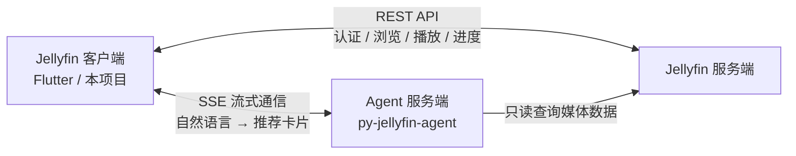
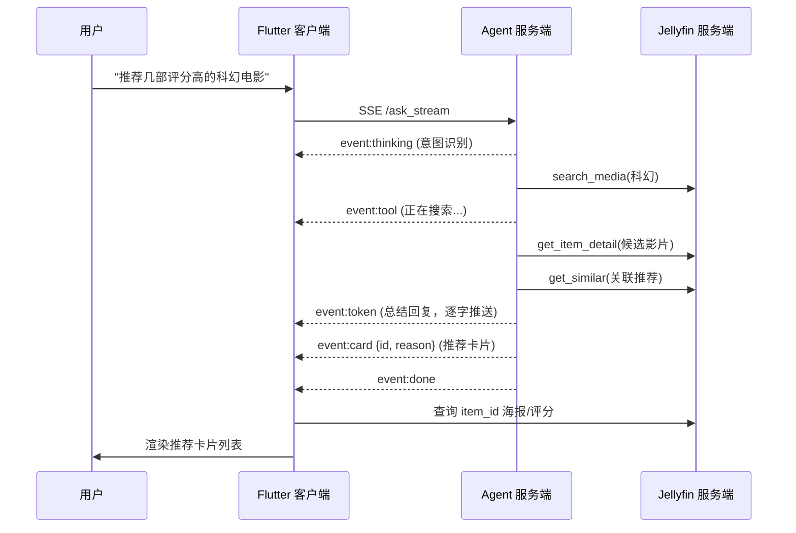

# Jellyfin Service SDK

基于 Flutter 的全功能 Jellyfin 客户端 SDK——AI 智能推荐、全类型流媒体、安卓 + 鸿蒙双平台。



---

## AI 智能推荐

> [演示视频](https://github.com/xueshengfei/ai-flutter-jellyfin/raw/master/AI%E6%8E%A8%E8%8D%90%E6%BC%94%E7%A4%BA%E8%A7%86%E9%A2%91.mp4)

基于独立部署的 Agent 后端实现，后端项目详见 [py-jellyfin-agent](https://github.com/xueshengfei/py-jellyfin-agent)。

> **后端简介**：基于 LangChain ReAct Agent 的 Jellyfin AI 助手。LLM 自动识别用户意图，路由到 6 大类查询工具（搜索/详情/剧集音乐/播放状态/推荐发现/媒体库统计），汇总结果后通过 SSE 流式返回。底层模型可自由替换（DeepSeek / OpenAI / 通义千问 / GLM 等），配置 `.env` 一行切换。

用自然语言描述想看什么，AI 自动搜索你的媒体库并给出带理由的推荐。

```
用户: "推荐几部评分高的科幻电影"

AI 思考中...  →  正在搜索...  →  逐字回复 + 推荐卡片
```

**意图识别与工具路由**：

```
用户提问 → LLM 意图识别 → 自动匹配工具类别 → 查询 Jellyfin → 总结返回

"找几部动作片"        →  搜索类    → search_media
"讲了什么"            →  详情类    → get_item_overview
"第一季有哪些集"       →  剧集音乐类 → get_episodes
"我看到哪了"          →  播放状态类 → get_resume_items
"和这部类似的还有吗"    →  推荐发现类 → get_similar
"有哪些分类/统计"      →  媒体库统计 → get_genres / get_media_stats
```

**工作流**：



**客户端集成**：

- **SSE 事件流**：`thinking` → `tool` → `token`（逐字推送）→ `card`（推荐卡片）→ `done`
- **轻量卡片协议**：后端只发 `item_id` + `reason`，客户端并发查询 Jellyfin 拿海报/评分/年份
- **多轮对话**：session 维护上下文记忆，最多 10 轮连续追问
- **平台适配**：web 用 fetch API，native 用 Dio，条件导入自动切换

---

## 安卓 + 鸿蒙双平台

同时支持 Android 和 HarmonyOS（ohos），集成社区鸿蒙化插件并完成验证：

| 插件 | 功能 | 本地路径 |
|------|------|---------|
| `video_player_ohos` | 视频播放 | `packages/ohos/video_player` |
| `fluttertpc_chewie` | 视频播放器 UI 控件 | `packages/ohos/fluttertpc_chewie` |
| `fluttertpc_just_audio` | 音频播放 | `packages/ohos/fluttertpc_just_audio` |
| `path_provider_ohos` | 文件路径 | `packages/ohos/path_provider` |
| `shared_preferences_ohos` | 本地存储 | `packages/ohos/shared_preferences` |

> **关于 `jellyfin_dart_3.8`**：接口 SDK 使用本地 `packages/jellyfin_dart_3.8` 版本（基于 Dart 3.8），而非上游最新的 Dart 3.9 版本。这是因为鸿蒙 Flutter 3.22 尚未支持 Dart 3.9 特性，降级依赖以确保鸿蒙平台兼容。

---

## 全类型流媒体

覆盖 Jellyfin 全部媒体类型，完整的流媒体播放能力：

| 类型 | 能力 |
|------|------|
| **电影** | 多维筛选（类型/年份/首字母/工作室/评分/HD/4K）、详情页、评分/导演/演员元数据 |
| **剧集** | 库 → 剧集 → 季 → 集 层级导航，播放进度记忆 |
| **音乐** | 专辑/歌手浏览，全局音频播放器 + 底部 MiniPlayer，歌词展示 |

> 视频播放演示：[视频功能演示视频.mp4](https://github.com/xueshengfei/ai-flutter-jellyfin/raw/master/%E8%A7%86%E9%A2%91%E5%8A%9F%E8%83%BD%E6%BC%94%E7%A4%BA%E8%A7%86%E9%A2%91.mp4) | 音乐播放演示：[音乐功能演示视频.mp4](https://github.com/xueshengfei/ai-flutter-jellyfin/raw/master/%E9%9F%B3%E4%B9%90%E5%8A%9F%E8%83%BD%E6%BC%94%E7%A4%BA%E8%A7%86%E9%A2%91.mp4)

### 视频播放与画质自适应

三种播放模式，自动选择最优方案：

| 模式 | 说明 |
|------|------|
| **DirectPlay** | 客户端直接播放原始文件，不转码 |
| **DirectStream** | 服务端流式传输，不重编码 |
| **Transcode** | 服务端转码为 HLS (H.264 + AAC)，兼容性最好 |

**画质切换**（手动 / 自动）：

```
自动  → 根据网络带宽动态调整
4K   → 15 Mbps
1080P → 5 Mbps
720P  → 2.5 Mbps
480P  → 1 Mbps
```

**自适应算法**：
- 滑动窗口采样（最多 10 个样本，3 分钟窗口）
- 降级立即执行，升级需连续确认 3 次
- 安全系数 0.7（使用 70% 估算带宽）
- 每 15 秒检测一次，切换时保持播放位置无缝衔接

**进度管理**：
- 每 10 秒向 Jellyfin 上报播放位置
- 根据 `playedPercentage` 计算精确恢复位置
- 切换画质时自动保存/恢复进度

---

## 快速开始

```yaml
# pubspec.yaml
dependencies:
  jellyfin_service:
    path: ../Jellyfin_Service
```

```dart
import 'package:jellyfin_service/jellyfin_service.dart';

// 创建客户端
final client = JellyfinClient(serverUrl: 'http://localhost:8096');

// 登录
final result = await client.auth.authenticate(
  username: 'user',
  password: 'pass',
);

// 获取媒体库
final libraries = await client.mediaLibrary.getMediaLibraries();
for (final lib in libraries.libraries) {
  print('${lib.type.icon} ${lib.name}: ${lib.itemCount} 项');
}
```

---

## 业务模块速查

### 核心服务

| 服务 | 关键方法 | 说明 |
|------|---------|------|
| **AuthService** | `authenticate()` / `logout()` / `initiateQuickConnect()` | 认证与会话管理 |
| **MediaLibraryService** | `getMediaLibraries()` / `getMovies(filter)` / `getSeasons()` / `getEpisodes()` | 媒体库浏览与层级导航 |
| **UserService** | `getContinueWatching()` / `updateUserItemData()` / `toggleFavorite()` | 进度上报、收藏、继续观看 |
| **ImageService** | 自动鉴权图片加载 | Jellyfin 图片需 token，封装为统一组件 |
| **ServerDiscoveryService** | `discoverServers()` | 局域网自动发现 Jellyfin 服务器 |

### 播放服务

| 组件 | 说明 |
|------|------|
| `VideoPlayerPage` | 视频播放页，支持画质切换 |
| `PlaybackService` | 播放控制、三种模式自动选择 |
| `AudioPlaybackManager` | 全局单例，音频播放状态 + 底部 MiniPlayer |
| `EpubReaderPage` | EPUB 阅读器，Isolate 解析 + 主题切换 + 进度恢复 |

### 页面一览

| 页面 | 功能 |
|------|------|
| `LoginPage` | 登录（账号密码 / Quick Connect） |
| `MediaLibrariesPage` | 媒体库主页 |
| `MovieFilterPage` → `MovieDetailPage` | 电影筛选 → 详情 |
| `SeasonsPage` → `EpisodesPage` | 剧集季 → 集列表 |
| `VideoPlayerPage` | 视频播放 |
| `MusicLibraryPage` → `AlbumDetailPage` → `LyricsPage` | 音乐浏览 → 专辑 → 歌词 |
| `BookLibraryPage` → `EpubReaderPage` | 书籍浏览 → EPUB 阅读 |
| `AIRecommendPage` | AI 推荐对话 |
| `PersonDetailPage` | 演员/导演详情 |
| `PersonalPage` | 个人中心 |

---

## SDK 内部分层

```
┌─────────────────────────────────────┐
│   Flutter 业务应用                    │
├─────────────────────────────────────┤
│   jellyfin_service  ← 本项目         │
│   业务 SDK：业务逻辑、自有模型、UI 组件  │
├─────────────────────────────────────┤
│   jellyfin_dart                      │
│   接口 SDK：1:1 API 映射、DTO 模型     │
├─────────────────────────────────────┤
│   Dio / HTTP                         │
└─────────────────────────────────────┘
```

---

## 项目结构

```
lib/
├── jellyfin_service.dart              # 主导出文件
└── src/
    ├── jellyfin_client.dart            # 主客户端（统一 API 入口）
    ├── services/                       # 服务层
    │   ├── auth_service.dart
    │   ├── media_library_service.dart
    │   ├── user_service.dart
    │   ├── image_service.dart
    │   ├── music_service.dart
    │   ├── book_service.dart
    │   ├── server_discovery_service.dart
    │   └── ai_recommendation_service.dart
    ├── models/                         # 业务模型
    ├── exceptions/                     # 异常体系
    ├── debug/                          # 调试工具
    └── ui/
        ├── services/                   # 播放、视图模式
        ├── widgets/                    # 通用组件
        └── pages/                      # 页面
```

---

## 技术栈

| 类别 | 技术 |
|------|------|
| 框架 | Flutter >=3.19.0 / Dart >=3.8.0 |
| HTTP | Dio ^5.9.0 |
| 视频 | video_player + chewie |
| 音频 | just_audio |
| EPUB | epubx ^4.0.0 |
| 图片 | cached_network_image ^3.4.0 |
| 动画 | flutter_animate ^4.5.2 |

---

## 许可证

MIT License
