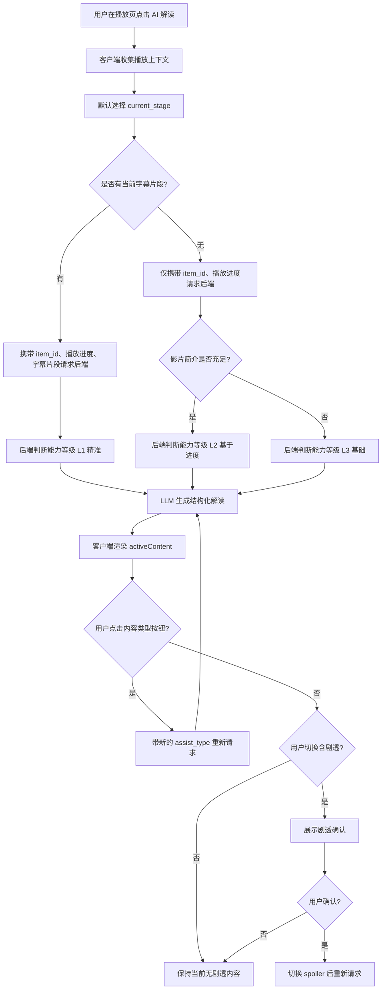
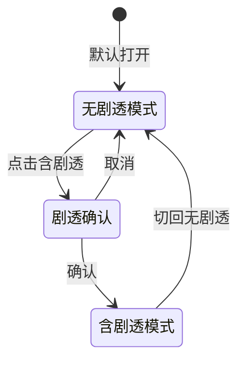
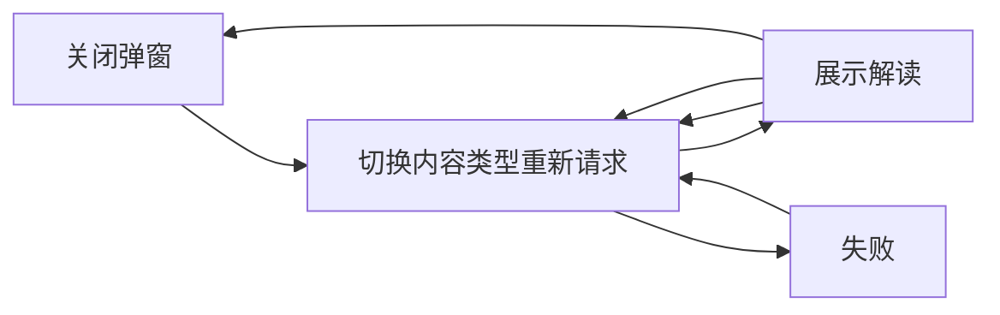

# 001 AI观影解读产品需求文档

## 1. 文档信息

| 字段 | 内容 |
|---|---|
| 产品模块 | 视频播放页 / AI 推荐后端 |
| 功能名称 | AI 观影解读 |
| 文档类型 | PRD |
| 当前版本 | v0.2 |
| 状态 | 后端 MVP 已实现，待客户端接入 |
| 目标端 | Flutter 客户端、FastAPI AI Agent 后端 |

## 2. 背景

当前 Jellyfin 客户端已经具备媒体浏览、播放、AI 推荐等能力。用户在观看电影时，常见需求不只是“播放”，还包括理解剧情、确认人物关系、获取无剧透提示、查看深层寓意，以及在看不懂某段内容时获得解释。

因此需要在视频播放页的自定义控制面板中增加一个 `AI 解读` 入口。用户点击后打开解读弹窗，由 AI 根据影片信息、当前播放进度、可选字幕片段生成观影辅助内容。

该功能不应被定义为简单的“剧情弹窗”，而应定位为“观影助手”：在不破坏观影体验的前提下，帮助用户更好理解影片。

## 3. 产品目标

1. 在播放页提供低打扰的 `AI 解读` 入口。
2. 默认提供无剧透解读，降低误剧透风险。
3. 支持用户主动切换到含剧透解析。
4. 在有字幕时提供更精准的当前片段解释。
5. 在无字幕时自动降级为基于影片简介和播放进度的阶段解读。
6. 输出结构化内容，便于客户端稳定渲染。
7. 将“全文概括、人物解析、主题寓意、结局解析”等内容做成弹窗内的小按钮，用户按需获取，不在首屏堆长文。

## 4. 非目标

1. 第一版不做逐帧画面识别。
2. 第一版不承诺精确到秒的剧情判断。
3. 第一版不强依赖字幕，字幕只作为增强输入。
4. 第一版不做影评社区、外部评分站点聚合。
5. 第一版不做长对话式 AI 聊天，只提供一次性解读结果。

## 5. 用户场景

### 5.1 无剧透了解影片

用户刚开始播放，想快速知道这部电影讲什么、主要看点是什么，但不想知道结局。

### 5.2 播放中理解当前阶段

用户看到中途，想知道自己大概处在剧情哪个阶段，以及前面的冲突为什么重要。

### 5.3 看不懂某段剧情

当影片存在字幕时，用户希望 AI 解释刚才几分钟的台词、人物动机、伏笔和冲突。

### 5.4 主动查看完整解析

用户看完或不介意剧透时，可以切换到含剧透模式，查看结局解释、主题寓意和深层解析。

## 6. 功能范围

### 6.1 播放页入口

在自定义控制面板中增加 `AI 解读` 按钮。

建议交互：

- 图标：`psychology`、`auto_awesome` 或类似 AI/解读语义图标。
- 文案：`AI 解读`。
- 位置：与画质、倍速、设置类按钮保持同一控制区域。
- 点击行为：打开底部弹窗或右侧抽屉。

### 6.2 解读弹窗

弹窗应包含以下区域：

1. 顶部标题：`AI 解读`
2. 能力标签：`精准` / `基于进度` / `基础`
3. 剧透模式切换：`无剧透` / `含剧透`
4. 内容类型按钮：`当前阶段` / `全文概括` / `人物解析` / `主题寓意` / `结局解析`
5. 内容主体
6. 错误与重试状态

默认进入 `无剧透` 模式。

第一版产品策略：

- 控制面板只放一个 `AI 解读` 入口。
- 弹窗内用小按钮承载不同解读需求。
- 每次只展示当前按钮对应的一块内容，避免一次性输出百科式长文。
- `结局解析` 在 `无剧透` 模式下保持锁定；用户切到 `含剧透` 后再请求。

### 6.3 无剧透内容

无剧透模式下，AI 不应透露当前播放时刻之后的关键反转、结局、真凶、死亡、隐藏身份等信息。

建议字段：

- `当前阶段`
- `全文概括`
- `当前进度阶段`
- `目前为止的理解提示`
- `人物解析`
- `主题寓意`
- `继续观看提示`

### 6.4 含剧透内容

含剧透模式必须由用户主动切换触发。

首次切换时建议弹出确认：

> 将展示后续剧情、结局或关键反转，确认继续？

建议字段：

- `完整剧情解析`
- `结局解释`
- `关键反转`
- `人物动机`
- `主题与寓意`
- `导演表达`

### 6.5 字幕增强

当当前影片存在字幕，客户端或后端可以提取当前播放时间前后 3-5 分钟字幕，传给 AI。

有字幕时支持：

- 刚才这段发生了什么
- 这段台词的含义
- 人物为什么这么做
- 当前伏笔提示

没有字幕时，不展示“刚才这段精准解释”，改为“基于进度的阶段解读”。

## 7. 信息源降级策略

AI 解读能力根据输入信息自动分级。

| 等级 | 输入信息 | 能力标签 | 可提供内容 | 可信度 |
|---|---|---|---|---|
| L1 | 电影信息 + 当前进度 + 当前字幕片段 | 精准 | 当前片段解释、台词含义、人物动机 | 高 |
| L2 | 电影信息 + 当前进度 | 基于进度 | 剧情阶段、无剧透提示、主题关键词 | 中 |
| L3 | 仅电影名或少量信息 | 基础 | 基础简介、可能主题、观影提示 | 低 |

无字幕时应明确提示：

> 未检测到可用字幕，以下解读基于影片简介和当前播放进度生成，可能无法精确对应当前画面。

## 8. 核心流程图



## 9. 剧透控制流程



## 10. 客户端请求参数草案

第一版采用最小输入：客户端只传播放上下文，影片元数据由 AI 后端通过 `item_id` 直接查询 Jellyfin。

```json
{
  "item_id": "abc123",
  "position_seconds": 4200,
  "spoiler_mode": "safe",
  "assist_type": "current_stage",
  "subtitle_window": null
}
```

字段说明：

| 字段 | 必填 | 说明 |
|---|---:|---|
| `item_id` | 是 | Jellyfin 媒体 ID，后端用它查询名称、简介、年份、类型、人物和总时长 |
| `position_seconds` | 是 | 当前播放秒数，由播放器提供 |
| `spoiler_mode` | 是 | `safe` 或 `spoiler` |
| `assist_type` | 否 | 当前弹窗小按钮类型，默认 `current_stage` |
| `subtitle_window` | 否 | 当前时间前后字幕文本；没有字幕时传 `null` |

`assist_type` 枚举：

| 值 | UI 文案 | 说明 |
|---|---|---|
| `current_stage` | 当前阶段 | 默认按钮，解释当前播放阶段和观看提示 |
| `plot_summary` | 全文概括 | `safe` 下给无剧透概括，`spoiler` 下可给完整概括 |
| `character_analysis` | 人物解析 | 分析人物关系、动机和变化 |
| `theme_analysis` | 主题寓意 | 分析主题表达、寓意和隐喻 |
| `ending_explanation` | 结局解析 | 仅 `spoiler` 模式可用 |

## 11. 后端响应结构草案

```json
{
  "schemaVersion": "watch_assist_v2",
  "itemId": "abc123",
  "title": "AI 解读",
  "mode": "safe",
  "requestedAssistType": "character_analysis",
  "assistType": "character_analysis",
  "assistTypeLabel": "人物解析",
  "availableAssistTypes": [
    {"type": "current_stage", "label": "当前阶段", "requiresSpoiler": false},
    {"type": "plot_summary", "label": "全文概括", "requiresSpoiler": false},
    {"type": "character_analysis", "label": "人物解析", "requiresSpoiler": false},
    {"type": "theme_analysis", "label": "主题寓意", "requiresSpoiler": false},
    {"type": "ending_explanation", "label": "结局解析", "requiresSpoiler": true}
  ],
  "capability": "progress_based",
  "capabilityLabel": "基于进度",
  "notice": "未检测到可用字幕，以下解读基于影片简介和当前播放进度生成。",
  "progress": {
    "positionSeconds": 4200,
    "runtimeSeconds": 6480,
    "percent": 64.8,
    "stage": "中后段：冲突升级"
  },
  "activeContent": {
    "title": "人物解析",
    "text": "当前可重点关注主角与家族之间的关系变化。",
    "items": ["主角立场变化", "家庭压力"]
  },
  "nonSpoiler": {
    "nonSpoilerSummary": "无剧透概括。",
    "currentStage": "中段：关系变化",
    "currentHint": "继续关注人物选择。",
    "characterFocus": "观察主要人物关系。",
    "themes": ["人物关系", "核心冲突"],
    "viewingTips": ["关注人物选择"]
  },
  "spoiler": null,
  "sections": [
    {
      "title": "人物解析",
      "content": "当前可重点关注主角与家族之间的关系变化。",
      "items": ["主角立场变化", "家庭压力"]
    }
  ],
  "canShowSpoiler": true
}
```

能力枚举：

| 值 | 含义 |
|---|---|
| `precise` | 有字幕，支持当前片段解释 |
| `progress_based` | 无字幕，基于影片信息和播放进度 |
| `basic` | 信息不足，仅基础解读 |

## 12. 后端接口建议

新增接口：

```text
POST /watch_assist
```

职责：

1. 接收 `item_id`、当前播放进度、剧透模式、内容类型、可选字幕片段。
2. 后端通过 `item_id` 直接查询 Jellyfin 元数据，减少客户端传参。
3. 判断能力等级。
4. 构造 LLM prompt。
5. 返回结构化 JSON。

该接口与现有 `/ask_stream` 不同，第一版建议使用普通 JSON 响应，不做 SSE。原因是弹窗内容较短，结构化渲染比逐字流式更重要。

客户端渲染建议：

1. 优先渲染 `activeContent`。
2. 使用 `availableAssistTypes` 渲染弹窗内小按钮。
3. `requiresSpoiler=true` 且当前 `mode=safe` 时，将按钮展示为锁定或点击后提示切换含剧透。
4. `sections` 作为兼容字段保留，不再作为第一优先级。

## 13. Prompt 设计原则

### 13.1 无剧透 Prompt 约束

无剧透模式必须遵守：

1. 不透露当前播放进度之后的剧情。
2. 不透露结局、真凶、死亡、反转、隐藏身份。
3. 如果无法判断当前剧情，只能说“基于播放进度推测”。
4. 优先解释主题、人物关系和目前为止的冲突。

### 13.2 含剧透 Prompt 约束

含剧透模式允许：

1. 解释完整剧情。
2. 解释结局。
3. 说明关键反转。
4. 分析人物动机、主题寓意、导演表达。

### 13.3 无字幕降级 Prompt 约束

无字幕时必须避免：

1. 声称知道当前画面。
2. 精确描述当前秒数发生的事件。
3. 编造影片不存在的情节。

应使用表达：

- “大概处于”
- “基于影片简介和播放进度推测”
- “可能正在进入”
- “如果当前画面不同，可切换到含字幕版本获得更准确解释”

## 14. 客户端状态



状态说明：

| 状态 | UI 表现 |
|---|---|
| `Idle` | 不展示弹窗 |
| `Loading` | 弹窗内展示加载态 |
| `Success` | 展示解读内容 |
| `Error` | 展示错误、重试按钮 |

## 15. UI 内容结构

建议弹窗结构：

```text
AI 解读                     基于进度
[无剧透] [含剧透]

[当前阶段] [全文概括] [人物解析] [主题寓意] [结局解析🔒]

提示：
未检测到可用字幕，以下解读基于影片简介和当前播放进度生成。

当前进度
64% · 中后段：冲突升级

人物解析
...

要点
主角立场变化 / 家庭压力
...
```

## 16. 验收标准

### 16.1 基础验收

1. 播放页控制面板可见 `AI 解读` 按钮。
2. 点击按钮后可打开解读弹窗。
3. 弹窗默认进入无剧透模式。
4. 无字幕时展示“基于进度”能力标签。
5. 有字幕时展示“精准”能力标签。
6. 后端返回结构化 JSON，客户端优先按 `activeContent` 渲染。
7. 请求失败时可重试。
8. 点击弹窗内小按钮时，可带新的 `assist_type` 重新请求并刷新内容主体。

### 16.2 剧透验收

1. 默认内容不出现结局、真凶、反转等剧透信息。
2. 切换含剧透前必须有确认。
3. 用户确认后才展示含剧透解析。
4. 切回无剧透后不继续显示含剧透内容。
5. `safe + ending_explanation` 不直接展示结局内容，后端返回 `assistType=current_stage` 并在 `notice` 提示需要切换含剧透。

### 16.3 降级验收

1. 无字幕但有简介时，展示基于进度的解读。
2. 无字幕且简介不足时，展示基础解读。
3. 无字幕时不声称能精准解释当前画面。
4. 当前播放时间为空时，按播放前解读处理。

## 17. 风险与对策

| 风险 | 说明 | 对策 |
|---|---|---|
| 误剧透 | LLM 可能在无剧透模式透露后续剧情 | Prompt 强约束 + 输出审查关键词 + 默认不请求 spoiler 内容 |
| 幻觉 | 冷门影片信息不足时可能编造 | 能力降级 + 提示“不确定” + 优先使用 Jellyfin metadata |
| 时刻不准 | 不同片源片长、片头片尾不同 | 使用播放百分比和阶段，而不是精确分钟 |
| 字幕缺失 | 部分影片没有字幕 | 字幕作为增强输入，不作为必需输入 |
| 响应慢 | LLM 请求可能耗时 | 弹窗 loading + 后端缓存同一影片同一模式结果 |

## 18. 后续迭代

1. 支持当前字幕片段自动提取。
2. 支持用户追问“刚才这段什么意思”。
3. 支持按播放进度缓存解读结果。
4. 支持剧集单集解读。
5. 支持角色关系图。
6. 支持将 AI 解读与已有 AI 推荐会话打通。
7. 支持根据用户观影偏好调整解读风格。

## 19. 待确认问题

1. 第一版弹窗采用底部弹窗还是右侧抽屉？
2. `AI 解读` 按钮放在控制面板哪个位置？
3. 第一版是否要接入字幕提取，还是先只传 `null`？
4. 含剧透确认弹窗的具体文案与视觉层级。
5. `activeContent.items` 在 UI 中使用列表、标签还是短卡片展示？
